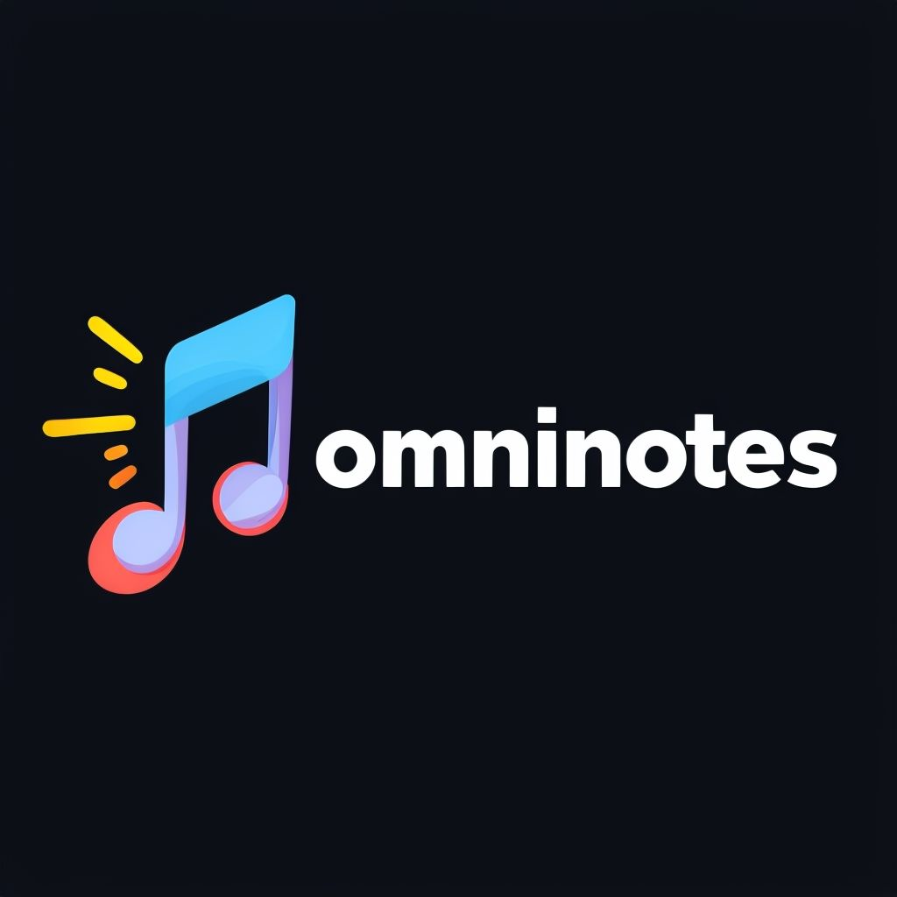

  

<!-- <h1 align="center">omninotes</h1> -->

  <em>Discover Music That Makes the World a Better Place</em>

<!-- TABLE OF CONTENTS -->

  
Table of Contents

- [📍 Overview](#-overview)
- [🎯 Features](#-features)
- [🤖Tech Stack](#-tech-stack)
- [🚀 Usage](#-usage)
- [👣 Workflow](#-workflow)
- [👀 Demo](#-demo)
- [🧑‍💻 Visit me](#-visit-me)

## 📍 Overview
Finding music that resonates with your vibe is akin to discovering a soulmate. The `omninotes` application tailors its recommendations to your musical preferences, serving as the foundation for its development. Our goal is to suggest the most suitable music pieces based on your unique tastes, including songs, artists, and local sounds.

## 🎯 Features

- [ ] Music Retrieval. 
- [ ] Music Recommendation.
- [ ] Music Re-creation.

_Note:_ Detail roadmap of each feature is described in [ROADMAP.](./assets/ROADMAP.md)

## 🤖 Tech Stack

- **Audio embedding:** CLAP (microsoft, and laion).

## 🚀 Usage

### In Development Stage

## 👣 Workflow

## 👀 Demo

## 🧑‍💻 Contact me

+ Gmail: minh.leduc.0210@gmail.com
+ Social Media: [LinkedIn]() | [GitHub]() | [Facebook]()
+ Blog: [Medium]() | [Substack]()
